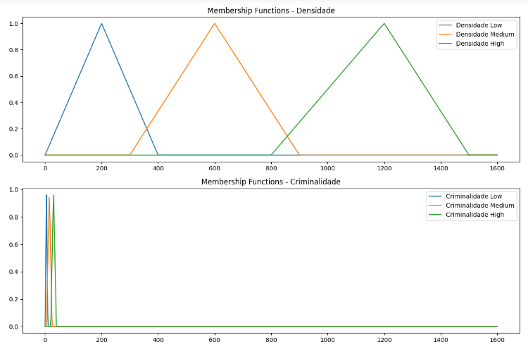

# Sistema de Alerta Fuzzy
Lógica Fuzzy para um sistema de Alerta que possa minimizar os riscos causados pela criminalidade pertinente a cada região específica numa navegação urbana .
Basicamente este exemplo, trata do processo de funcionamento de um sistema especialista nebuloso (Fuzzy), baseado em regras de produção. Mostrando , em detalhes, o processo de fuzzificação, 
utilizando operações AND e OR nas regras, de implicação, de agregação e defuzificação. O sistema possui duas entradas, uma saída, três funções de pertinência nas variáveis de entrada
e cinco funções de pertinência nas variáveis de saída com as regras utilizando pelo menos uma operação AND e uma OR, o método de implicação utilizado é  o produto, o método de agregação
é o de máximo e o método de defuzificação é o do centroide. 
Para isso serão definidas 02 variáveis de entrada sendo estas a densidade populacional e latência criminal ( diz quantas vezes um crime de mesma natureza se repete num intervalo de tempo específico) , ambas associadas a uma região em análise, e 01 variável de saída que é o Alerta de segurança.

Conjunto Fuzzy de Entrada

Nessa parte atribuímos valores nominais, característicos da lógica Fuzzy,  às variáveis de entrada associados aos intervalos, parâmetros para as funções de pertinência.

Densidade Populacional

   - Baixa (0 - 500 hab/km²)
   - Média (400 - 1000 hab/km²)
   - Alta (800 - 1500 hab/km²)
       
Latência Criminal ( Nº de Crimes / mês )

   - Baixa (0 - 10 crimes/mês)
   - Média (5 - 20 crimes/mês)
   - Alta (15 - 30 crimes/mês)

  Conjunto Fuzzy de saída

   Alerta de Segurança

 	 - Baixo (0 - 20%)
   - Médio (15 - 40%)
   - Alto (35 - 60%)
   - Muito Alto (55 - 80%)
   - Extremo (75 - 100%)

Regras do sistema

1. Se Densidade populacional é Baixa E Latência Criminal é Baixa, então Alerta é Baixo.
2. Se Densidade populacional é Alta E Latência Criminal  é Alta, então Alerta é Extremo.
3. Se Densidade populacional é Média OU Latência Criminal  é Alta, então Alerta é Muito Alto.

	Para uma análise com os valores de entrada de Densidade populacional = 700 e Latência criminal = 18

O código SisAlerta.py permite a implementação das ações descritas anteriormente de modo a termos como saídas os seguintes valores:
Membership Densidade: (0, 0.5, 0)
Membership Criminalidade: (0, 0.8666666666666667, 0.2)
Regra 1 (Baixo): 0
Regra 2 (Extremo): 0.2
Regra 3 (Muito Alto): 0.5
Implicação (Método Produto): [0, 0.2, 0.5], [0, 0.2, 0.5]
Agregação (Método Máximo): 0.5
Defuzificação (Método Centroide): 36.42857142857143
       

- Para que possamos visualizar as funções de pertinência referentes as entradas utilizamos o código 'PlotIn.py', para tal, nele é feita a definição das funções de pertinência:

fuzzy_membership_triangular: Esta função implementa uma função de pertinência triangular, que retorna a pertinência de um valor a um conjunto fuzzy triangular definido pelos parâmetros lower_bound, peak e upper_bound.
fuzzy_membership_trapezoidal: Esta função implementa uma função de pertinência trapezoidal, que retorna a pertinência de um valor a um conjunto fuzzy trapezoidal definido pelos parâmetros left_bound, left_peak, right_peak e right_bound.

Para obtenção dos gráficos é utilizada a biblioteca matplotlib

A saída desse sistema será o alerta de perigo, classificado de acordo com a lógica de um sistema nebuloso.
